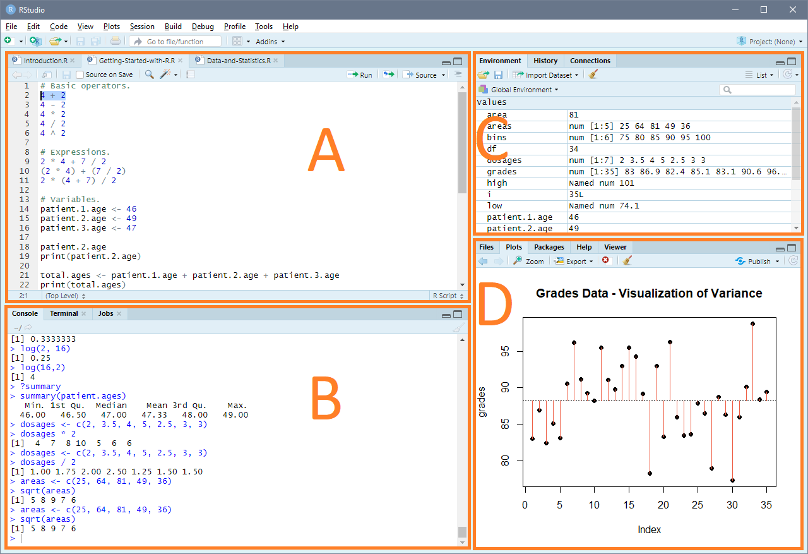

# Fundamentals

## Contents

- [Fundamentals](#fundamentals)
  - [Contents](#contents)
  - [Introduction](#introduction)
  - [Getting Started with R](#getting-started-with-r)
    - [Operators](#operators)
    - [Expressions](#expressions)
    - [Variables](#variables)
    - [Functions](#functions)
  - [Data and Statistics](#data-and-statistics)
    - [Example: Student Grades](#example-student-grades)
    - [Histograms](#histograms)
    - [Try it Yourself](#try-it-yourself)
    - [Stem and Leaf Plots](#stem-and-leaf-plots)
  - [Numerical Summaries](#numerical-summaries)
    - [Measures of Central Tendency](#measures-of-central-tendency)
      - [Arithmetic Mean](#arithmetic-mean)
      - [Median](#median)
      - [Mean vs. Median](#mean-vs-median)
      - [Five-Number Summary](#five-number-summary)
    - [Measures of Variability](#measures-of-variability)
      - [Range, Interquartile Range, and Outliers](#range-interquartile-range-and-outliers)
      - [Variance](#variance)
      - [Standard Deviation](#standard-deviation)
  - [Graphical Summaries](#graphical-summaries)
    - [Histograms](#histograms-1)
    - [Boxplots](#boxplots)
  - [References](#references)

## Introduction

*Code for this section:* [Introduction](/Fundamentals/Introduction.R)


The aim of this course is to develop your understanding of the science and practice of statistics using principles of mathematics and computation. You will learn how to:

1. design experiments to collect data;
1. perform statistical analyses;
2. build and interpret mathematical models of data; and
3. produce and interpret graphics like the one above.

It is likely that you have come across statistics in one form or another, whether you were aware of it or not. Statistics is used to gain an understanding of data and make predictions about the future. It allows weather reporters to predict what a storm might do and doctors to understand the health of their patients or the prognosis of an illness. Statistics is applied in a wide range of areas: mathematics, economics, social sciences, trade, research, programming, Big Data, data science, health, business, government, and education [[1]](#references). And this list is far from exhaustive.

In a statistical setting, we are concerned with the collection, analysis, and presentation of empirical data using statistical methods [[2]](#references). Inherent to this setting are two key concepts of **uncertainty** and **variation** [[2]](#references). In this course, you will learn to make statistical statements about populations of interest while accounting for uncertainty and variation in the analytical techniques and/or underlying data.

## Getting Started with R

*Code for this section:* [Getting Started with R](/Fundamentals/Getting-Started-with-R.R)

The computational tool that will be used throughout this course is R. It is a "language and environment for statistical computing and graphics" [[3]](#references). To get started, it is recommended that you download and install the latest version of RStudio, an integrated development environment for R that will be used in this course:

[Download R Studio](https://rstudio.com/products/rstudio/download/#download)

If you choose to use R Studio, these are the four primary areas of the application you will need to be concerned with:



| # | Name | Description |
|--|------|-------------|
| A | Source Pane | Displays your R scripts; allows you to run and save code |
| B | Console | Displays the output of your code; allows to to execute code on-demand |
| C | Environment Pane | Displays information about the R environment, including variables and their current values |
| D | Files, Plots, Packages | Displays graphical plots, files, and information such as help files |

We will briefly discuss the basic aspects of R that you will need to know to get started in this course.

### Operators

To begin, the table below summarizes common operators you will use.

| Operator | Purpose | Example | Example Output |
|----------|---------|---------|----------------|
| + | Add | 4 + 2 | 6 |
| - | Subtract | 4 - 2 | 2 |
| * | Multiply | 4 * 2 | 8 |
| / | Divide | 4 / 2 | 2 |
| ^ | Raise to a power | 4 ^ 2 | 16 |

### Expressions

Similar to mathematics, R allows you, the programmer, to combine terms using operators in order to compute a result. Each such combination of terms and operators is an **expression**. Complex expressions can be combined, and R will generally follow the mathematical order of operations. For example, the expression `2 * 4 + 7 / 2` evaluates to `11.5`. It is as though the expression has implicit parenthetheses: `(2 * 4) + (7 / 2)`. Also similar to mathematics, you can force an expression to be evaluated in a specific order by adding patentheses. The expression `2 * (4 + 7) / 2`, for example, contains the same numbers in the same order before, but evaluates to `11` instead of `11.5`.

### Variables

Often, you will want to store data and the results of performing operations on data so that you can use them later. A **variable** allows you to assign names to values of interest. In R, the general form of a variable is:

```R
variable.name <- value.or.expression
```

To the left of the `<-` is the name you want to give your variable. The convention in R is to use lower-case letters and separate words by a period. You can also include numbers in your variable names. The `<-` itself is known as the **assignment operator**, as it is the operator you use to assign values to variables. To the right of the assignment operator is the value or expression you want to store in your variable.

As an example, suppose you want to store the ages of three hospital patients. You could do the following:

```R
patient.1.age <- 46
patient.2.age <- 49
patient.3.age <- 47
```

Now you can use the patients' ages anywhere in your R code by referring to the variable name. For example, to view patient 2's age, you can enter the variable name in the console or use the `print()` function on the variable. Both are shown below with the corresponding output:

```R
patient.2.age
[1] 49

print(patient.2.age)
[1] 49
```

You do not need to store single values in a variable; you can also store expressions. The code below adds the age of all three patients together and stores the result in a variable `total.ages`, then prints out the result:

```R
total.ages <- patient.1.age + patient.2.age + patient.3.age
print(total.ages)
[1] 142
```

Frequently in statistics, we are working with more than a single value. We work with data sets that include many values, so storing values in individually named variables would quickly become inefficient. A **vector** in R is a collection of elements, all of the same type. It allows us to save multiple values into a single variable name. Vectors are created in R using the `c()` function and passing in a comma-separated list of values:

```R
patient.ages <- c(46, 49, 47)
print(patient.ages)
[1] 46 49 47
```

A conventient propert of vectors in R is that operations can be stated once and then computed for *each* value in the vector. Suppose we know the dosages of a medication for 7 patients and new research comes out, strongly urging that dosages of the medication are cut in half. The following code illustrates this scenario:

```R
dosages <- c(2, 3.5, 4, 5, 2.5, 3, 3)
dosages / 2
[1] 1.00 1.75 2.00 2.50 1.25 1.50 1.50
```

### Functions

R is comprised of functions that are useful for many actions. You have already seen `print()`, which prints the value of the variable (or text in quotation marks) that you pass to it, and `c()` which returns a vector comprised of the values you pass to it. Try to anticipate the output of running the following code before running it to check that you understand the concept.

```R
print(c("This", "is", "a", "string", "vector"))
```

This is the general form of functions in R - they have a name followed by parentheses, inside of which are the **arguments** that you pass to them. The arguments are taken as input to the functions, actions are performed using those inputs, and the functions return a value or stop processing once the work is complete. The table below shows some functions in R to get you started. We will learn many more functions throughout the course and even create our own.

| Function | Description | Arguments | Example |
|----------|-------------|-----------|---------|
| help(topic) | Retrieve helpful information about a topic in R | topic - the topic, for which help is sought | help(print) |
| c() | Combines items into a vector | A comma-separated list of values, all of the same type | c(1, 2, 3, 4, 5) |
| print(x) | Prints output to the console | x - the object to print | print("This is an example.") |
| sqrt(x) | Take the square root | x - the value to take the square root of | area <- 81; sqrt(area) |
| log(x, b) | Compute a logarithm | x - the number to take the log of; b - the base of the log | log(16, 2) |

Functions can be vectorized in R. That is, you can pass a vector of values into many R functions and they will be perform their actions for *each* value in the vector. Consider the following example and its output, showing how we could find the length of the sides of squares from their areas:

```R
areas <- c(25, 64, 81, 49, 36)
sqrt(areas)
[1] 5 8 9 7 6
```

## Data and Statistics

*Code for this section:* [Data and Statistics](/Fundamentals/Data-and-Statistics.R)

Let us discuss the general design of experiments to gain an appreciation for data and statistics.

When we do analytical work, we have a **population** we are interested in studying, comprised of people, objects, or events. For example, we may study the grades of students in a statistics course or the number of car accidents that occur with different road conditions or the efficacy of a vaccine. Each member or unit in the population is an **observational unit** or **experimental unit**.

To study these populations, we collect **data** about them. That is, we make **observations** by taking **measurements** of certain aspects of the observational units. For example, we may record the grades of statistics students, the number of vehicles involved in accidents and the road conditions, or the reduction of disease in vaccinated groups of individuals.

Each of these characteristics of a population (and we can study multiple characteristics of a single population) is called a **variable**. The value of a characteristic is different between different observational units. One student in a statistics course may have earned a 96% in the course, while another student earned a 74%. There are two types of variables:

- **Quantitative variables**: Variables that take on a numerical value (e.g., grades, ages, temperature). These are also called **continuous variables**.
- **Qualitative variables**: Variables that categorize observational units (e.g., gender, vehicle color, group). These are also called **categorical variables**.

### Example: Student Grades

With this understanding of data and statistics, we simulate our first data set - the grades of statistics students. Run the code below for yourself and we will analyze the output.

```R
# Simulate student grades.
grades <- rnorm(35, 88, 4.7)
hist(grades, main="Histogram of Grades", xlab="Grade", ylab="Frequency")
```
This code produces the following output (your specific output will vary):


### Histograms

This graphic is known as a **histogram** - it is a graphical summary of the underlying data. For now, understand that we randomly generated 35 student grades (from a Normal Distribution with a mean of 88 and standard deviation of 4.7) and assigned the randomly generated grades to a variable `grades` using the `<-` assignment operator. We then used the `hist()` function that is part of base R to plot the histogram.

The histogram shows how frequently students earned grades in each of the ranges shown on the horizontal x-axis. We can see from the histogram that 3 students earned a grade between 75 and 80, 6 students earned a grade between 80 and 85, and so on. The ranges on the x-axis of a histogram are known as **bins** and we can set the bins to be any width. The y-axis shows the **frequency**, or the number of times in the data that a value that falls within each of the bins occurred.

Now we can begin to answer questions about the grades we simulated. We know that we simulated 35 grades, so we can say that 3/35 = 8.6% of the students earned a grade between 75 and 78. Similarly, we can ask how many students earned a grade of 90 or better. Reading the frequencies from the histogram, we see that 7 students earned a grade between 90 and 95 and 5 students earned a grade between 95 and 100. The answer to the question is that (7 + 5)/25 = 34.3% of the students earned a grade of 90 or better.

We can use the `length()` function in R, which counts the number of elements in a variable, to answer these same questions. First, notice how we can take a variable like grades, which is stored in a data type known as a **vector** in R, and get a `TRUE` or `FALSE` output for each observation, depending on whether it matches a criterion (>= 90 in this case):

```R
grades >= 90
 [1] FALSE FALSE FALSE FALSE FALSE  TRUE  TRUE  TRUE FALSE FALSE  TRUE  TRUE FALSE
[14]  TRUE  TRUE  TRUE FALSE FALSE  TRUE FALSE  TRUE FALSE FALSE FALSE FALSE FALSE
[27] FALSE FALSE FALSE FALSE FALSE  TRUE  TRUE FALSE FALSE
```

We can use this to include all of the `TRUE` and exclude all of the `FALSE` from our grades data:

```R
grades[grades >= 90]
 [1] 90.6 96.2 91.2 95.5 91.1 93.0 95.5 94.3 93.0 96.3 90.1 98.8
```

The length of this subset will tell us how many students earned grades of 90 or above:

```R
length(grades[grades >= 90])
[1] 12
```

If we divide this by the length of all students grades, we get the same 34.3% that we calculated above:

```R
length(grades[grades >= 90]) / length(grades)
[1] 0.3428571
```

### Try it Yourself

Use R to find out what percentage of students received grades less than 75%.

### Stem and Leaf Plots

R also has a `stem()` function than produces a **stem and leaf plot** like the one below. Notice that this is similar to the histogram above, but uses numbers instead of graphics. Stem and leaf plots partition each observation in the data into a stem (left of the "|") and a leaf (right of the "|") [[4]](#references). The stem and leaf plot produced by R below partitions each observation at the decimal point. The values in the data set (76.3, 78.2, 78.9, ...) are mapped to (76|3, 78|2, 78|9, ...) Check that you understand how to translate between the plot below and the histogram above:

```R
stem(grades)

  The decimal point is at the |

  76 | 3
  78 | 29
  80 | 
  82 | 401346
  84 | 1
  86 | 003599
  88 | 2472348
  90 | 1612
  92 | 00
  94 | 355
  96 | 23
  98 | 8
```

## Numerical Summaries

*Code for this section:* [Data and Statistics](/Fundamentals/Data-and-Statistics.R)

In statistics, we are particularly concerned with measures of central tendency and measures of variability, which we will discuss next. These summaries will aid in our understanding of the uncertainty and variation inherent in the data and introduced as a result of our analysis.

### Measures of Central Tendency

We will seek to understand the arithmetic mean and the median next. These **measures of central tendency** attempt to summarize the data, recognizing the property that data tend to cluster around some central value.

#### Arithmetic Mean

The simplest numerical summary is the **arithmetic mean**, which can be thought of as the average or expected value. It is calculated as the sum of all observations divided by the number of observations:


In statistics, the artithmetic mean is often denoted by the variable y with a bar over it, pronounced "y-bar". The variable n in statistics is used to denote the number of observations. The Σ is the Greek letter sigma and in mathematics, it is used to mean that you add together all of its terms. For our example of statistics student grades, the arithmetic mean would be calculated as:


R has a built-in function `sum()`, which performs the summation for us, so we can calculate the arithmetic mean for student grades as follows:

```r
sum(grades) / length(grades)
[1] 88.18571
```

Calculating means is such a common activity that R has a built-in function for it, `mean()`. Notice that this gives the same result:

```R
mean(grades)
[1] 88.18571
```

The arithmetic mean (we will refer to it as the "mean" from now on) is a one-number summary of the data. That is, we take the entire set of data into consideration to produce a single numerical summary, the mean. In the process of boiling the data down into a single number or **point estimate**, we lose some information. In particular, we cannot reverse engineer the mean to get the original data back out of it.

It is important to note at this point that the mean has a major shortcoming: it is heavily influenced by outliers and especially large outliers. That is, extermely large values that are unusal for a given data set skew the mean to be artificially high. This kind of skew caused by large outliers can be visualized as below:

```R
# Visualize skew caused by an outlier.
y <- c(10, 15, 14, 15, 4, 20, 5, 3, 2, 9, 12, 16, 6, 13, 10, 9,
       14,8, 9, 3, 2, 7, 11, 12, 13, 16, 8, 7, 5, 7, 6, 9, 4, 21, 30)
hist(y)
abline(v=mean(y), col="tomato2")
```

This code produces the follow plot. Note that the mean (red line) is pulled right of the bin with the highest frequency by the outlier, in this case 30:


#### Median

The shortcomings of the mean are overcome by the **median**, which is far more resistant to outliers. The median is the middle value in the data set when the data are written in order. The formula for median is:


Fortunately, R has a built-in function for this, too:

```R
median(y)
[1] 9
```

#### Mean vs. Median

The mean is "essentially a model of your data set[;] it is the value that is most common" [[5]](#references), and it should be noted that the mean and median values many not be present as an observation in the data. For example, the median value may be exactly between the two values in the middle of the data (if n, the number of observations, is even). While both the mean and the median summarize the data, do not expect that either will actually be present in the data.

In summary, you should use the mean as a measure of central tendency when:

- data do not contain large outliers; and
- data are not significantly skewed.

You should use median as a measure of central tendency when these conditions are not met.

#### Five-Number Summary

The mean and median are used in a common set of numerical summaries known as a **five-number summary**. This summary involves the minimum (smallest) values, first quartile, median, third quartile, and maximum (largest value). We will discuss quartiles in the section on variability below, but for our purposes now, you can generate a five-number summary in R using the `summary()` function:

```R
summary(grades)
   Min. 1st Qu.  Median    Mean 3rd Qu.    Max. 
  77.30   84.35   88.40   88.19   91.15   98.80 
```

Notice that R includes the mean in the summary, so this is really a 5+1-number summary.

### Measures of Variability

#### Range, Interquartile Range, and Outliers

Let us return to the concept of a five-number summary:

```R
summary(grades)
   Min. 1st Qu.  Median    Mean 3rd Qu.    Max. 
  77.30   84.35   88.40   88.19   91.15   98.80 
```

Expanding on our understanding of this output, **quartiles** divide data into four equally-sized groupings, such that 25% of the observations fall below the first quartile (and 75% above), 50% fall below the second quartile (and 50% above), and 75% fall below the third quartile (and 25% above). To visualize this, observe the following variable X and convince yourself that 25% of the observations fall below 25 (Q1), 50% fall below 32 (Q2), and 75% fall below 36 (Q3):


The median, by definition is the second quartile (Q2) because 50% of the observations fall below and and 50% fall above it. In the data above, the mean and second quartile would be (28 + 32) /2 = 30.

From the five-number summary, we can calculate two ranges. The **range** is the total amount of variation in the data, or the difference between the largest and smallest values. From the five-number summary of statistics students' grades above, we see that the range is 98.80 - 77.30 = 21.5. R has a helpful function `range()` that returns the smallest and largest values of a variable:

```R
range(grades)
[1] 77.3 98.8
```

The second range we can calculate is known as the **interquartile range** and it is the difference between Q3 (the third quartile) and Q1 (the first quartile):


In our student grades data, we can calculate the interquartile range by subtracting Q1 from Q3 or by using the `IQR()` function:

```R
IQR(grades)
[1] 6.8
```

The overall range gives the total amount of variation in the data, while the interquartile range gives the amount of variation in the middle 50% of the data. Remembering the tendency of data to be clustered around the central value, we can use the interquartile range to identify data points that do not follow that tendency. In general, we define outliers in the data to be data points that are less than (Q1 - 1.5 * IQR) or greater than (Q3 + 1.5 * IQR). Or, equivalently, we say that outliers fall in the ranges:


Let us see if we have any outliers in our student grades data:

```R
# Check for outliers in student grades.
low <- quantile(grades)['25%'] - (1.5 * IQR(grades))
high <- quantile(grades)['75%'] + (1.5 * IQR(grades))
grades[grades <= low]
  numeric(0)
grades[grades >= high]
  numeric(0)
```

It appears that there are no outliers.

#### Variance

Recall that we are concerned with uncertainty and variability in statistics. For this reason, measures of variability are some of the most important quantities in statistics [[6]](#references). Variation helps us understand the way data are spread or distributed better. Consider two variables, X= {3, 4, 5} and Y = {1, 4, 7}. Both X and Y have the same mean, 4, but the data are clearly not the same. The values are spread out much more from each other in Y than in X. Variation allows us to capture this property in a numerical summary.

Before we can understand variance, we need to understand the concept of degrees of freedom. **Degrees of freedom** are the number of values that are free to vary. Suppose we had a sample of 4 numbers and their arithmetic mean was 4. We pick numbers for our sample set one by one and observe the overall set at each step:

{1, _, _, _}

We have added one number. We can pick any value for the next element. Let us pick 5:

{1, 5, _, _}

We have added another number. We can pick any value for the next element. Let us pick 3:

{1, 5, 3, _}

We have added another number, but we cannot pick any value for the next element. Because the mean for the sample set is 4, the only possible value for the last element is 3 since (1 + 5 + 3 + 3) / 4 = 4.

In this example, we had a variable with n=4 observations and n-1=3 of them were allowed to vary. This is generally the case that when we estimate one parameter from a variable, we lose a degree of freedom. In the case of means, we are estimating a single parameter, and so the degrees of freedom are:


The degrees of freedom can be calculated for the grades example in R by `length(grades) - 1`. Returning to variance, we are interested in measuring the variability in the data, or how much the data tends to differ from the mean. For each data point, we can calculate its difference from the mean. This quantity is known as a **residual** and is given by:


The residuals can be calculated for the grades example in R by `grades - mean(grades)`. If we were to add the residuals together, they would equal 0 for every data set. This is not a useful property, so we instead add the squared residuals together. This quantity is one of the most important in statistics [[6]](#references) and is known as the **sum of squares**:


The sum of squares can be calculated for the grades example in R by `sum((grades - mean(grades)) ^ 2)`. Now we average the sum of squares across all values in the data to get the variance. Since we lose one degree of freedom by calculating the mean, we divide by n-1:


The variance can be calculated for the grades example in R by `sum((grades - mean(grades)) ^ 2)/(length(grades) - 1)`. R has a built-in function for calculating the variance that performes exactly these calculations, `var()`:

```R
var(grades)
[1] 28.02597
```

The variance gives us a sense of the variability in the data. The higher the variance, the more likely individual observations are to deviate from the mean and the wider the spread and distribution of the data. The smaller the variance, the more likely individual observations are to be clustered very close to center. Variance is used in many statistical techniques, so it is recommended that you review this section until you understand it intuitively.

#### Standard Deviation

As we have seen, variance gives us a sense of the variability in the data, or how much the observations tend to deviate from the mean. Due to the way the variance is calculated, it is **dimensionless**, meaning it cannot be expressed in terms of any units like percentage or miles. To account for this, the **standard deviation** takes the square root of the variance, which produces a measure of variability that can be expressed in the same units as the original data.


In R, the standard devation can be calculated as the square root of the variance using the `sqrt()` function or simply by using the `sd()` function:

```R
sqrt(var(grades))
[1] 5.293956

sd(grades)
[1] 5.293956
```

## Graphical Summaries

*Code for this section:* [Data and Statistics](/Fundamentals/Data-and-Statistics.R)

### Histograms

We have already seen one graphical summary - the histogram. It shows the frequency of observations in the data that fall within a range of values called bins. Histograms are useful under the same conditions as means, i.e., when there are no large outliers present and the data are not skewed. Histograms are generated in R using the `hist()` function.

### Boxplots

Another graphical summary that is useful for understanding data is a **boxplot** or **box and whiskers diagram**. Boxplots depict the five-number summary we saw earlier in a graphical format and can be easily generated by using the `boxplot()` function in R. The boxplot below was generated for the grades data we have been working with:

```R
# Generate a boxplot for student grades.
boxplot(grades, main="Boxplot for Student Grades", xlab="Grade", horizontal=TRUE)
```


You can see the main features of a boxplot: the minimum and maximum values plotted as whiskers on the extreme edges of the plot; and Q1, the median, and Q3 in the central region of the plot. Observing the plot, we get a sense of the spread and distribution of the data. It shows how large a region is spanned by each quarter of the data [[4]](#references).

Outliers in the data can be read off a boxplot - R plots outliers by default as being outside of the upper and lower whiskers:

```R
# Generate a boxplot for a variable with an outlier.
y <- c(10, 15, 14, 15, 4, 20, 5, 3, 2, 9, 12, 16, 6, 13, 10, 9,
       14,8, 9, 3, 2, 7, 11, 12, 13, 16, 8, 7, 5, 7, 6, 9, 4, 21, 30)
boxplot(y, horizontal=TRUE)
```


## References
1. https://statanalytica.com/blog/importance-of-statistics/
2. https://www.stat.uci.edu/what-is-statistics/
3. https://www.r-project.org/about.html
4. https://faculty.atu.edu/mfinan/3153/section13.pdf
5. https://statistics.laerd.com/statistical-guides/measures-central-tendency-mean-mode-median.php
6. Crawley, Michael J. "Statistics: An Introduction Using R". 2nd Edition, 2015, pp. 50-54.