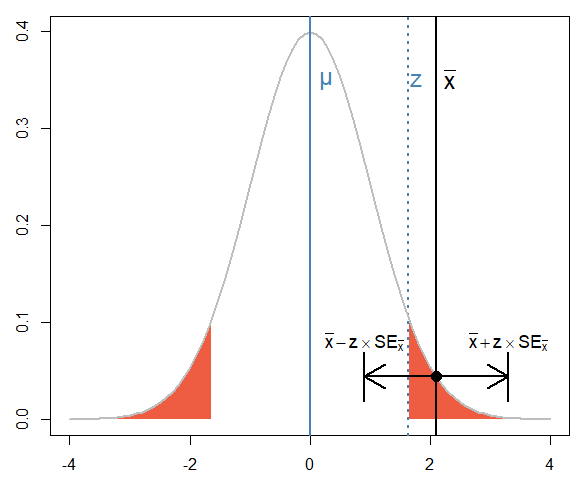
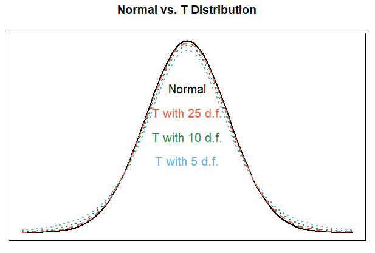

# Tests of the Mean

## Contents

- [Contents](#contents)
- [Introduction](#introduction)
- [Procedure for Hypothesis Testing](#procedure-for-hypothesis-testing)
- [Standard Error](#standard-error)
- [Significance Tests and Confidence Intervals](#significance-tests-and-confidence-intervals)
- [One-Sample Tests](#one-sample-tests)
  - [One-Sample Z-Test](#one-sample-z-test)
    - [Example: Weight loss program](#example-weight-loss-program)
  - [One-Sample T-Test](#one-sample-t-test)
    - [Calculations in the T Distribution](#calculations-in-the-t-distribution)
    - [Example: Customer transaction time](#example-customer-transaction-time)
    - [Example: Student ages](#example-student-ages)
- [Two-Sample Tests](#two-sample-tests)
  - [Two-Sample T-Test](#two-sample-t-test)
    - [Example: Medical treatment](#example-medical-treatment)
- [Matched Pair Tests](#matched-pair-tests)
- [Summary](#summary)
- [References](#references)

## Introduction

In the previous module, we built upon the concepts the Normal Distribution, the Central Limit Theorem, and confidence intervals to understand how to conduct formal tests of hypotheses and make statements about a population parameter based on available sample data and a level of significance. We will build upon these ideas in this module as we dig into the details of z-tests for one and two samples, as well as a related t-test for one and two samples.

## Procedure for Hypothesis Testing

Because of its importance in the science of statistics, let us recap the general hypothesis testing procedure we learned in the last module:

> **Hypothesis Testing Procedure**
> 1. State the hypotheses and select a significance level.
> 2. Select the test statistic.
> 3. State the decision rule.
> 4. Compute the test statistic.
> 5. Draw a conclusion.

In step 1, we state:

- The <ins>null hypothesis H<sub>0</sub></ins>, which is a statement of "no difference" or "no change";
- The <ins>alternative hypothesis H<sub>1</sub></ins>, which is the alternative to H<sub>0</sub> that we are actually interested in showing; and
- The <ins>significance level α</ins>, which sets the strength of evidence required to be able to reject H<sub>0</sub>.

In step 2, we select the test statistic. We have already seen one test statistic, the z-test or z-statistic:


In step 3, we state the decision rule that would allow us to reject H<sub>0</sub> or force us to fail to reject H<sub>0</sub>. The rule can take one of two forms:

> Reject H<sub>0</sub> if the test statistic is as extreme or more extreme than a critical value. Fail to reject H<sub>0</sub> otherwise.

or:

> Reject H<sub>0</sub> if the p-value associated with the test statistic is less than or equal to α. Fail to reject H<sub>0</sub> otherwise.

Both forms of the decision rule yield the same conclusion but using the p-value allows readers of the study to select their own significance level and determine whether the result is still significant.

In step 4, we carry out the test by computing the test statistic we selected in step 2.

In step 5, we draw a conclusion based on the value of the test statistic from step 4, applying the decision rule from step 3.

## Standard Error

We glossed over the denominator of the one-sample z-test *σ/√(n)* when we first looked at it, but it deserves some discussion. When estimating a population parameter using sample data, there is some unreliability, given that the sample size is smaller than the population size and may not be completely representative. The **standard error** is a measure of the unreliability of an estimate we make of a population parameter, expressed in the same terms as the parameter we are estimating [[3]](#references).

Recall that variance is a measure of the variability of data points in a sample with respect to the mean. It tells us how much the values in the sample differ from the mean on average. When the variance increases (i.e., there is more variability in the data), the unreliability also increases. When the variance decreases (i.e., there is less variability in the data), the unreliability also decreases. This means that unreliability is proportional to the variance [[3]](#references):


With larger sample sizes, unreliability decreases, so unreliability is inversely proportional to the sample size [[3]](#references):


Just like we take the square root of the variance to get the standard deviation, we can take the square root of the unreliability measure to get the standard error. It is denoted SE<sub>y̅</sub> and known as the **standard error of the mean**:


You will see that estimating different parameters from sample data produces different standard error values. It may be useful to recognize that the standard error is to sample data as the standard deviation is to population data - a measure of variability or unreliability.

Thus, we can summarize the variability measures we have seen so far as follows:

| Parameter (Population) | Standard Deviation (Population) | Statistic (Sample) | Standard Error (Sample) |
|------------------------|---------------------------------|--------------------|-------------------------|
| µ | σ/√(N) | x̅ | s/√(n) |

We will expand this table in the sections that follow. Using this understanding of standard error as a measure of uncertainty in a sample statistic, we can generalize the test statistic as:


That is, the test statistic is the difference between the observed statistic and the one we expect, divided by a measure of uncertainty.

## Significance Tests and Confidence Intervals

*Code for this section:* [Significance Tests and Confidence Intervals](/One-and-Two-Sample-Tests/Significance-Tests-and-Confidence-Intervals.R)

You have seen how to carry out a formal test of significance. This five-step procedure will apply to all of the formal tests we examine in this course. In this section, we point out the relationship between significance tests and confidence interval.

In the five-step procedure for testing hypotheses, we stated two different forms of the decision rule:

> <ins>1. Based on the test statistic:</ins>
> - **Left-tailed test**: Reject H<sub>0</sub> if z (test) is less than or equal to z (critical).
> - **Right-tailed test**: Reject H<sub>0</sub> if z (test) is greater than or equal to z (critical).
> - **Two-tailed test**: Reject H<sub>0</sub> if z (test) is as extreme or more extreme than z (critical).
> 
> <ins>2. Based on the p-value:</ins>
> - **Left-tailed test**: Reject H<sub>0</sub> if the p-value associated with the z-statistic is less than the significance level α.
> - **Right-tailed test**: Reject H<sub>0</sub> if the p-value associated with the z-statistic is greater than the significance level α.
> - **Two-tailed test**: Reject H<sub>0</sub> if the p-value associated with the z-statistic is more extreme than the significance level α.

These two decision rules are mathematically equivalent and result in the same conclusion. There is a third way to conduct the test and that is based on the confidence interval. A two-sided test will reject the null hypothesis if the *(1 - α)* confidence interval around the sample mean does not contain the mean under the null hypothesis [[2]](#references). That is, we can reject H<sub>0</sub>: µ = µ<sub>0</sub> if the *(1 - α)* confidence level around x̄ does not contain µ<sub>0</sub>.

Let us visualize this relationship:



To understand this setting, suppose you have a sample with mean x̄ and a known population mean of µ. To test whether the sample mean x̄ is significantly different from a population mean µ<sub>0</sub>, you construct a 95% confidence level around x̄: *(x̄ - z • SE<sub>x̄</sub>, x̄ - z • SE<sub>x̄</sub>)*. If µ<sub>0</sub> falls inside this 95% confidence interval, you fail to reject H<sub>0</sub>. If µ<sub>0</sub> falls outside of this 95% confidence interval, you reject H</sub>0</sub>.

Thus, you can assert that any value outside of the 95% confidence interval for the sample mean x̄ is significantly different. In other words, you can determine whether the sample mean x̄ is significantly different from any mean of interest µ<sub>0</sub> simply by determining whether µ<sub>0</sub> falls within the (1 - α) confidence interval of x̄.

To state this decision rule formally:

> <ins>3. Based on a confidence interval:</ins>
> - **Two-tailed test**: Reject H<sub>0</sub> if *µ<sub>0</sub> ∈ (x̄ - z • SE<sub>x̄</sub>, x̄ - z • SE<sub>x̄</sub>)*.

This form of the decision rule is often preferred over using p-values since it gives information about statistical significance and the strength of the effect [[4]](#references).

## One-Sample Tests

*Code for this section:* [One-Sample Tests](/One-and-Two-Sample-Tests/One-Sample-Tests.R)

### One-Sample Z-Test

The test we have seen already is known as a **one-sample z-test**. It allows us to determine whether a statistically significant difference exists between the measured sample mean and a population mean of interest. In order to use this test, we need to ensure its assumptions are met [[1]](#references):

1. The data come from a single sample.
2. The mean and variance of the population are known.
3. The test statistic follows a Normal Distribution.

These assumptions require a known mean and variation for the population, but as you know the population data are often not available. The population parameters are sometimes known, for example from literature or industry publications, but they are frequently unknown and so the z-test is rarely used in practice. As an ancillary assumption for using the z-test, a sample size of n ≥ 30 is required.

The one-sample z-test for sample means is:


We can select any value for the mean under the null hypothesis, µ<sub>0</sub>, though we most often select the population mean or an otherwise established mean to compare with our sample mean. The null hypothesis for a one-sample z-test is:

> H<sub>0</sub>: µ = µ<sub>0</sub>

We can test three possible alternative hypotheses with a one-sample z-test:

> H<sub>1</sub>: µ > µ<sub>0</sub> (right-tailed test)
> 
> H<sub>1</sub>: µ < µ<sub>0</sub> (left-tailed test)
> 
> H<sub>1</sub>: µ < µ<sub>0</sub> or µ > µ<sub>0</sub> (two-tailed test)

When we carry out the steps outlined in the hypothesis testing procedure above, we find that the test statistic falls in the middle region of the Normal Distribution, in which case we fail to reject H<sub>0</sub>, or it falls outside the middle region (in the rejection region), in which case we reject H<sub>0</sub>. Since the null hypothesis asserts *no difference* or *no change*, we are interested in rejecting H<sub>0</sub> because it means there *is* a difference or change between the mean we observed in the sample (x̅) and the established mean (µ<sub>0</sub>).

#### Example: Weight loss program

A sample of 42 people who participated in a weight loss program was taken. The participants' change in weight was measured upon completion of the program. A change of -2 means the participant lost two pounds, and a change of 1 means the participant gained one pound, and so on. The mean weight change for all participants in the program was found to be -2.26 with a standard deviation of 6.58. Formally test whether there is significant evidence of weight loss among program participants.

**State the hypotheses and significance level**

> H<sub>0</sub>: μ = 0 (participant weight did not change)
> 
> H<sub>1</sub>: μ < 0 (participant weight decreased)
> 
> α = 0.05

**Select the test statistic**


**State the decision rule**

We find a critical value from the Normal Distribution with a left-hand tail probability of α, z<sub>0.05</sub>:

```R
critical.z <- qnorm(0.05, lower.tail=TRUE)
print(critical.z)
[1] -1.644854
```

We reject H<sub>0</sub> if the p-value associated with the z-statistic is less than α. Otherwise, we fail to reject H<sub>0</sub>.

**Compute the test statistic**

```R
test.z <- (-2.26 - 0) / (6.58 / sqrt(42))
print(test.z)
[1] -2.225908
```

The p-value associated with this z-statistic is:

```R
pnorm(test.z, lower.tail=TRUE)
[1] 0.01301018
```

**Draw a conclusion**

We reject H<sub>0</sub>: µ = 0 since 0.01 < 0.05. We have significant evidence at the α = 0.05 level of significance that participants in the weight loss program lost weight on average (p = 0.013).

The visualization below shows the results of this test. The dotted blue line is the critical z-value (-1.64). The solid blue line is the z-statistic (-2.23). The z-statistic is inside the rejection region, allowing us to reject the null hypothesis. The p-value associated with the z-statistic is the shaded red region.


### One-Sample T-Test

Situations arise where the assumptions required for a one-sample z-test do not hold. In fact, it is frequently the case that we do not have access to an entire population. In these situations, we cannot use a z-test. In these cases, we instead use a t-test. The concepts are the same, but we use a different distribution.

The **T-distribution** is a bell-shaped distribution that is used to carry out hypothesis tests when the population mean and standard deviation are not known. It has wider tails than the Normal Distribution. Since we do not know the mean, we need to estimate it from the sample data, and thus we are concerned with *n - 1* degrees of freedom. The heaviness of the tails in a t-distribution are a function of the degrees of freedom in the sample, with smaller values producing a heavier tail [[5]](#references).

Notice how the t-distribution compares with the Normal Distribution as the degrees of freedom vary:



The higher the degrees of freedom (and the closer the sample size is to 30), the more the t-distribution looks like the Normal Distribution. For lower degrees of freedom (and therefore smaller sample sizes), the fatter the tails of the t-distribution. The probability getting extreme values (values that are far from the mean) is higher in the t-distribution than in the Normal Distribution [[5]](#references).

The procedure for carrying out a one-sample t-test is identical to a one-sample z-test:

> 1. State the hypotheses and select a significance level.
> 2. Select the test statistic.
> 3. State the decision rule.
> 4. Compute the test statistic.
> 5. Draw a conclusion.

Instead of a z-statistic, we use a **t-statistic**:


with *n - 1* degrees of freedom.

You will notice that the formula for a t-test is nearly identical to the formula for a z-test.

The assumptions that must be met for a one-sample t-test are [[6]](#references):

1. The data come from a single sample.
2. The mean and variance of the population are not known.
3. The test statistic follows a Normal Distribution.

A t-test can also be used in place of a z-test when *n < 30*.

#### Calculations in the T Distribution

The R functions used to carry out t-procedures follow the same form as those for z-procedures, exchanging "norm" for "t":

| Function | Parameters | Returns | Example |
|----------|------------|---------|---------|
| `pt()` | `q` - the quantile; `df` - the degrees of freedom | `p` - the `p`-value associated with `q` | `pt(-1.96, df=9)` |
| `qt()` | `p` - the `p`-value associated with `q`; `df` - the degrees of freedom | `q` - the quantile | `qt(0.041, df=9)` |
| `dt()` | `q` - the quantile; `df` the degrees of freedom | `d` - the probability of a specific event occurring | `dt(1.96, df=9)` |

By default, R calculates the lower tail for each of these functions. By specifying `lower.tail=FALSE`, you can calculate the upper tail. Given the symmetrical nature of the T Distribution, this is equivalent to 1 minus the lower tail.

Just as we could look up the z-statistic in a z-table, we can look up a z-statistic in a t-table like the one below:

[T-Table](http://www.ttable.org)

For example, we can find the t-value associated with a one-tailed test with a 5% level of significance and 9 degrees of freedom:


Equivalently, in R:

```R
qt(0.05, df=9, lower.tail=FALSE)
[1] 1.833113
```

We use the notation t<sub>α,df</sub> to refer to the critical t-value with a left- or right-hand tail probability of α (or both, in the case of a two-tailed test) and *df* degrees of freedom. This would be t<sub>0.05,9</sub> for the example above.

R also has a built-in function for carrying out a one-sample t-test, `t.test()`. The sample data must be stored in a variable and passed into the function. The function takes three arguments:

| Argument | Description | Example |
|----------|-------------|---------|
| `x` | A vector of values | `x = c(1, 2, 3, 4, 5)` |
| `mu` | The mean under the null hypothesis, µ<sub>0</sub> | `mu = 3` |
| `alternative` | "less" for a left-tailed test, "greater" for a right-tailed test, or "two.sided" for a two-sided test | `alternative = "greater"` |

Suppose you have a variable from a sample *X = {1, 2, 3, 4, 5}*. You can use the `t.test()` function to test whether the mean value in the sample is greater than 2.5:

```R
t.test(x = c(1, 2, 3, 4, 5), mu = 2.5, alternative = "greater")

	One Sample t-test

data:  c(1, 2, 3, 4, 5)
t = 0.70711, df = 4, p-value = 0.2593
alternative hypothesis: true mean is greater than 2.5
95 percent confidence interval:
 1.492557      Inf
sample estimates:
mean of x 
```

From the output, you can see that the t-statistic is 0.70711 on 4 degrees of freedom and the associated p-value is 0.2593.

The standard error for a one-sample t-test is:


The confidence interval for a one-sample t-test is:


The confidence interval can be calculated for you by conducting a two-sided test using the `t.test()` function. The "95 percent confidence interval" section of the output shows the interval. For a valid confidence interval to be constructed, you must use a two-sided test.

#### Example: Customer transaction time

A retail business is interested in decreasing the amount of time customers spend during checkout transactions. A sample of *n = 25* customer transactions is taken and the mean transaction time is found to be *2.89* minutes with a standard deviation of *s = 0.54*. Previous transaction data show that the mean transaction time was *µ = 3.02 minutes* per transaction with an unknown standard deviation. Did the business succeed in decreasing customer transaction time?

**State the hypotheses and significance level**

> H<sub>0</sub>: μ = 3.02 (transaction time did not change)
> 
> H<sub>1</sub>: μ < 3.02 (transaction time decreased)
> 
> α = 0.05

**Select the test statistic**


**State the decision rule**

We find a critical value from the t-distribution with *25 - 1 = 24* degrees of freedom a left-hand tail probability of α, t<sub>0.05, 24</sub>:

```R
critical.t <- qt(0.05, df=24)
print(critical.t)
[1] -1.710882
```

We reject H<sub>0</sub> if the p-value associated with the t-statistic is less than α. Otherwise, we fail to reject H<sub>0</sub>.

**Compute the test statistic**

```R
test.t <- (2.89 - 3.02) / (0.54 / sqrt(25))
print(test.t)
[1] -1.203704
```

The p-value associated with this t-statistic is:

```R
pt(test.t, df=24)
[1] 0.1202214
```

**Draw a conclusion**

We fail to reject H<sub>0</sub>: µ = 3.02 since 0.12 > 0.05. We do not have significant evidence at the α = 0.05 level that the retail business decreased customer transaction time.

The visualization below shows the results of this test. The dotted blue line is the critical t-value (-1.71). The solid blue line is the z-statistic (-1.20). The t-statistic fell outside of the rejection region, so we were unable to reject the null hypothesis. The p-value associated with the t-statistic is the shaded red region.


#### Example: Student ages

10 students of all ages were selected at random to participate in a study. Their ages are given below. Informally test the following three hypotheses (assume a 0.05 significance level):

> 1. The mean age of students is less than 20.
> 2. The mean age of students is at least 16.
> 3. The mean age of students is different from 16.9.

> <ins>Student Ages:</ins>
> 
> 12, 14, 15, 16, 16, 18, 18, 19, 20, 21

**Solution**

We can use R's built-in `t.test()` function to carry out the tests.

<ins>Hypothesis 1: mean age < 20</ins>

```R
t.test(ages, mu=20, alternative="less")

	One Sample t-test

data:  ages
t = -3.4927, df = 9, p-value = 0.003401
alternative hypothesis: true mean is less than 20
95 percent confidence interval:
     -Inf 18.52701
sample estimates:
mean of x 
     16.9 
```

We reject the null hypothesis since *p = 0.003* is less than *α = 0.05*. There is significant evidence that the mean age of students is less than 20.

<ins>Hypothesis 2: mean age ≥ 16</ins>

```R
t.test(ages, mu=16, alternative="greater")

	One Sample t-test

data:  ages
t = 1.014, df = 9, p-value = 0.1685
alternative hypothesis: true mean is greater than 16
95 percent confidence interval:
 15.27299      Inf
sample estimates:
mean of x 
     16.9
```

We fail to reject the null hypothesis since *p > α*. There is not significant evidence that the mean age of students is at least 16.

<ins>Hypothesis 3: mean age ≠ 16.9 </ins>

```R
t.test(ages, mu=16.9, alternative="two.sided")

	One Sample t-test

data:  ages
t = 0, df = 9, p-value = 1
alternative hypothesis: true mean is not equal to 16.9
95 percent confidence interval:
 14.89218 18.90782
sample estimates:
mean of x 
     16.9 
```

We fail to reject the null hypothesis since *p > α*. There is not significant evidence that the mean age of students is different from 16.9. The 95% confidence interval for the mean age of students is *(14.89, 18.91)*.

## Two-Sample Tests

There are many situations in which it is useful to compare the means of two populations. The efficacy of a medication may be assessed by measuring the effect in two groups, one that receives the medication and one that does not. A retail business may compare the price of its products across two different stores. A government agency may be interested in the cost of living across two different cities. In all of these cases, we can boil the question down to a comparison of the mean in each of two different populations [[2]](#references).

As with one-sample tests, certain assumptions must be met to ensure the applicability of a two-sample test [[7]](#references):

1. The data are normally distributed, or approximately so.
2. The variances of the two populations are equal.
3. The two samples are independent (that is, the values in one sample do not depend on the values of the other).
4. Both samples are constructed through a process of random sampling, whereby each observation is equally likely to be included in the sample.

### Two-Sample T-Test

The two-sample t-test is similar in form to the one-sample t-test, except that it compares the *difference* in means across the two samples:


In this test, the two samples are assigned numbers *1, 2* such that x̅<sub>1</sub> is the observed mean of sample 1, µ<sub>2</sub> is the hypothesized mean of sample 2, and so on. The degrees of freedom in a two-sample t-setting can be calculated using the formula below:


This formula is cumbersome, so a less conservative estimate is frequently used:


The standard error for this test is:


The null hypothesis in the two-sample t-setting is:

> H<sub>0</sub>: µ<sub>1</sub> = µ<sub>2</sub> (the mean of the samples is equal)

The alternative hypotheses we can test are:

> **Left-tailed test**: H<sub>1</sub>: µ<sub>1</sub> > µ<sub>2</sub> (the mean of the sample 1 is greater)
> 
> **Right-tailed test**: H<sub>1</sub>: µ<sub>1</sub> < µ<sub>2</sub> (the mean of the sample 2 is greater)
> 
> **Two-tailed test**: H<sub>1</sub>: µ<sub>1</sub> ≠ µ<sub>2</sub> (the means are different)

As with all significance tests, we can construct a confidence interval:


Finally, we want to point out that the R function `t.test()` can be used in the two-sample setting by supplying the values from both samples: `t.test(sample.1.values, sample.2.values)`.

#### Example: Medical treatment

Medical researchers are testing a treatment they believe could reduce fevers in patients in certain situations. They measure the change in temperature for 36 patients (in Fahrenheit) 30 minutes after applying the therapy. They measure the change in temperature for another 36 patients (in Fahrenheit) who did not receive the treatment in the same 30 minutes. The data for each group of patients are shown below, where a *-a* indicates a patients temperature decreased by *a*. Is there significance evidence at the *α = 0.10* level that the treatment was successful in reducing fevers?

> <ins>Treatment Group</ins>
> 
> 98.2, 96.7, 93.0, 91.0, 98.5, 93.1, 99.7, 99.7, 93.9,
> 99.1, 95.8, 100.7, 104.3, 100.0, 96.2, 98.2, 99.5, 101.4,
> 96.4, 99.2, 90.9, 97.4, 94.9, 96.8, 96.9, 96.8, 89.1,
> 97.2, 96.9, 98.6, 101.3, 102.7, 95.4, 97.7, 92.9, 96.1
> 
> <ins>Control Group (No Treatment)</ins>
> 
> 100.0, 96.8, 101.0, 100.0, 98.7, 96.1, 95.3, 101.7, 93.3,
> 99.6, 96.8, 90.1, 97.1, 104.2, 97.1, 99.3, 100.4, 95.1,
> 96.9, 92.3, 101.0, 96.8, 95.5, 97.8, 97.5, 98.8, 100.9,
> 98.6, 96.8, 101.3, 95.1, 96.9, 99.0, 96.8, 98.7, 100.5

For this test we set the treatment group as sample 1 and the control group as sample 2.

**State the hypotheses and significance level**

> H<sub>0</sub>: μ<sub>1</sub> = μ<sub>2</sub> (the mean temperature is the same for both groups)
> 
> H<sub>1</sub>: μ<sub>1</sub> < μ<sub>2</sub> (the mean temperature is lower for the treatment group)
> 
> α = 0.10

**Select the test statistic**


**State the decision rule**

We find a critical value from the t-distribution with *min(n<sub>1</sub>, n<sub>2</sub>) - 1 = 35* degrees of freedom a left-hand tail probability of α, t<sub>0.10, 35</sub>:

```R
df <- min(length(treatment), length(control)) - 1
critical.t <- qt(0.1, df=df)
print(critical.t)
[1] -1.306212
```

We reject H<sub>0</sub> if the p-value associated with the t-statistic is less than α. Otherwise, we fail to reject H<sub>0</sub>.

**Compute the test statistic**

```R
test.t <- (mean.treatment - mean.control) /
  sqrt((var.treatment / length(treatment)) + (var.control / length(control)))
print(test.t)
[1] -0.71814
```

The p-value associated with this t-statistic is:

```R
pt(test.t, df=df)
[1] 0.2387173
```

**Draw a conclusion**

We fail to reject the null hypothesis H<sub>0</sub>: μ<sub>1</sub> = μ<sub>2</sub> since 0.239 > 0.10. We do not have significance evidence at the *α = 0.10* level that there is a significance difference in the mean temperature of the treatment and control groups. We cannot infer that the treatment was successful in reducing fevers in patients.

**Alternate method**

We could have carried out this test using the `t.test()` function in R. Note that this function uses a more conservative value for degrees of freedom, so the results vary slightly:

```R
t.test(treatment, control, alternative="less")

	Welch Two Sample t-test

data:  treatment and control
t = -1.054, df = 68.168, p-value = 0.1478
alternative hypothesis: true difference in means is less than 0
95 percent confidence interval:
      -Inf 0.4462299
sample estimates:
mean of x mean of y 
 97.11667  97.88333 
```

From this result, we draw the same conclusion because *p = 0.148* > *α = 0.10*.

## Matched Pair Tests

In addition to one-sample tests and two-sample tests of the mean, we can consider at a **matched pair design**, or tests involving the difference in between two variables for the same subject [[8]](#references). These could be before- and after-treatment variables in a clinical setting, measurements on twins, measurements from the same location, or variables that are otherwise correlated. Such tests are called **matched pair tests** and the process for carrying them out is identical to that of a one-sample test, but with slightly different notation.

Suppose you have two variables, *X* and *Y* that are paired, for example the amount a pain physical therapy patients feel in their legs before and after treatment, measured on a scale of 1-10 (10 being the worst pain) and reported by the patients. A sample data set is shown below:

| X | Y |
|---|---|
| 6 | 4 |
| 6 | 5 |
| 4 | 2 |
| 5 | 5 |
| 8 | 5 |
| 7 | 1 |

```R
# Load the data into R.
x <- c(6, 6, 4, 5, 8, 7)
y <- c(4, 5, 2, 5, 5, 1)
```

In matched pair design, the procedure is to create a new variable *d* that is the difference between the variables, that is *d = x - y* for each *x, y*:

| X | Y | D = X - Y |
|---|---|-----------|
| 6 | 4 | 2 |
| 6 | 5 | 1 |
| 4 | 2 | 2 |
| 5 | 5 | 0 |
| 8 | 5 | 3 |
| 7 | 1 | 6 |

Then we can take the mean of D, which we call the **mean of the differences**:


```R
mean.difference <- sum(d)/length(d)
print(mean.difference)
[1] 2.333333
```
Using the mean difference, we can construct a t-test:


You will notice this test is identical in form to a one-sample t-test, except that it uses different notation. The hypotheses are the same as in the one-sample setting:

> H<sub>1</sub>: µ > µ<sub>0</sub> (right-tailed test)
> 
> H<sub>1</sub>: µ < µ<sub>0</sub> (left-tailed test)
> 
> H<sub>1</sub>: µ < µ<sub>0</sub> or µ > µ<sub>0</sub> (two-tailed test)

The standard error in this setting is:


Confidence intervals in the matched pairs setting are:


To carry out a matched pairs t-test in R, you can use the `t.test()` function and specify `paired = TRUE`:

```R
t.test(x, y, paired = TRUE)

	Paired t-test

data:  x and y
t = 2.767, df = 5, p-value = 0.03951
alternative hypothesis: true difference in means is not equal to 0
95 percent confidence interval:
 0.1656284 4.5010383
sample estimates:
mean of the differences 
               2.333333 
```
Carrying out the test in this manner produces the t-statistic, degrees of freedom, p-value, associated confidence interval (assuming a two-sided test), and mean of the differences.

## Summary

| Concept | Discussion | Formula | R Code | Examples |
|---------|------------|---------|--------|----------|
| Standard error | A measure of unreliability of an estimated population parameter | [depends on test] | N/A | N/A |
| One-sample z-test | A test used when population standard deviation is known, and/or *n >= 30*<br>H<sub>0</sub>: μ = μ₀<br>H<sub>1</sub>: μ > μ₀ or μ < μ₀ or μ ≠ μ₀ | <br><br> | N/A | N/A |
| One-sample t-test | A test used when z-test assumptions do not hold, population standard deviation is not known, and/or *n < 30*<br>H<sub>0</sub>: μ = μ₀<br>H<sub>1</sub>: μ > μ₀ or μ < μ₀ or μ ≠ μ₀ | <br><br> | `t.test()` | `t.test(x)` |
| Two-sample t-test | A t-test used with two samples from different populations<br>H<sub>0</sub>: μ₁ = μ₂<br>H<sub>1</sub>: μ₁ > μ₂ or μ₁ < μ₂ or μ₁ ≠ μ₂ | <br><br> | `t.test()` | `t.test(x, y)` |
| Matched pairs t-test | A t-test used with two variables related to the same subject, location, etc.<br>H<sub>0</sub>: μ = μ₀<br>H<sub>1</sub>: μ > μ₀ or μ < μ₀ or μ ≠ μ₀ | <br><br> | `t.test()` | `t.test(x, y, paired = TRUE)` |

## References

1. http://www.analystsoft.com/en/products/statplus/content/help/analysis_basic_statistics_one_sample_z-test.html
2. Verzani, John. "Using R for Introductory Statistics". 2nd Edition, 2014, pp. 310-312, 321-322.
3. Crawley, Michael J. "Statistics: An Introduction Using R". 2nd Edition, 2015, pp. 60-62.
4. https://www.ncbi.nlm.nih.gov/pmc/articles/PMC2689604/.
5. https://www.investopedia.com/terms/t/tdistribution.asp
6. http://www.analystsoft.com/en/products/statplus/content/help/analysis_basic_statistics_one_sample_t-test.html
7. https://ncss-wpengine.netdna-ssl.com/wp-content/themes/ncss/pdf/Procedures/NCSS/Two-Sample_T-Test.pdf
8. https://sphweb.bumc.bu.edu/otlt/MPH-Modules/BS/SAS/SAS4-OneSampleTtest/SAS4-OneSampleTtest7.html
